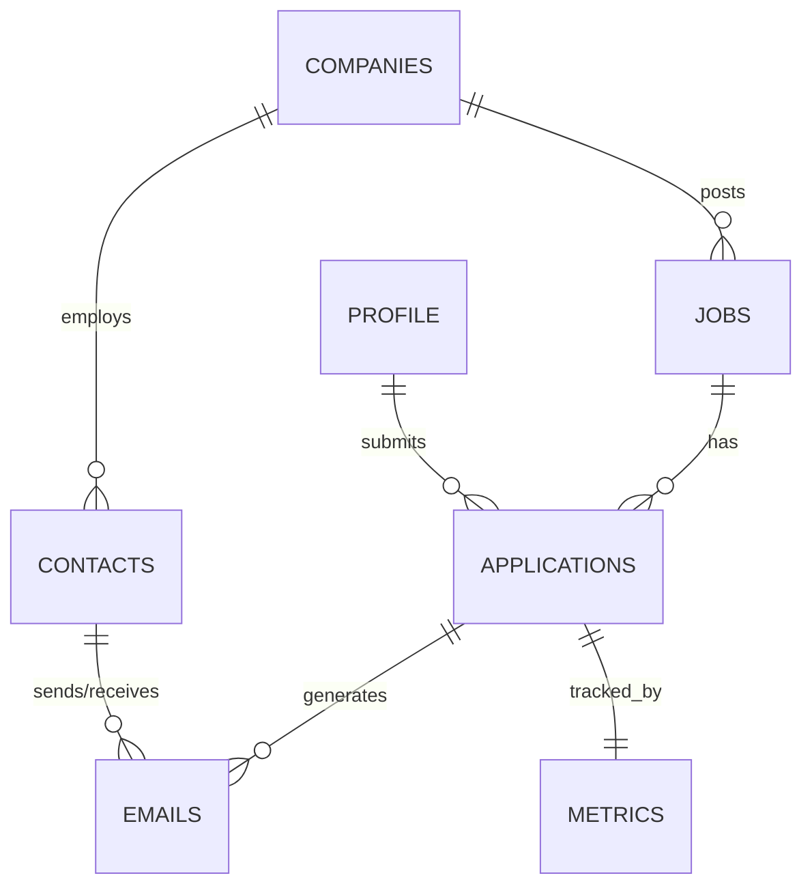

# Unified Database Schema Design
## AI Talent Optimizer Platform v3.0

Generated: 2025-08-26

---

## Executive Summary

### Current State
- **19 databases** with significant redundancy
- **1,072 total records** scattered across databases
- **13 duplicate table names** across different databases
- Major data fragmentation causing consistency issues

### Target State
- **1 unified database**: `unified_platform.db`
- **8 core tables** with clear relationships
- Normalized schema with foreign key constraints
- Single source of truth for all platform data

---

## Detailed Schema Design

### 1. JOBS Table
**Purpose**: Centralized repository of all job opportunities from all sources

```sql
CREATE TABLE jobs (
    -- Primary Key
    id INTEGER PRIMARY KEY AUTOINCREMENT,
    
    -- Unique Identifiers
    job_id TEXT UNIQUE NOT NULL,  -- External ID from source
    source TEXT NOT NULL,          -- 'linkedin', 'indeed', 'company_site', etc.
    
    -- Core Job Information
    company TEXT NOT NULL,
    title TEXT NOT NULL,
    department TEXT,
    level TEXT,  -- 'entry', 'mid', 'senior', 'staff', 'principal', 'director'
    
    -- Location
    location TEXT,
    city TEXT,
    state TEXT,
    country TEXT DEFAULT 'USA',
    remote_type TEXT,  -- 'remote', 'hybrid', 'onsite'
    
    -- Compensation
    salary_min INTEGER,
    salary_max INTEGER,
    salary_currency TEXT DEFAULT 'USD',
    equity_offered BOOLEAN DEFAULT 0,
    
    -- Job Details
    description TEXT,
    requirements TEXT,
    responsibilities TEXT,
    benefits TEXT,
    tech_stack TEXT,  -- JSON array of technologies
    
    -- URLs and References
    url TEXT,
    apply_url TEXT,
    
    -- Scoring and Priority
    relevance_score REAL DEFAULT 0.0,
    priority_score REAL DEFAULT 0.0,
    ai_match_score REAL DEFAULT 0.0,
    
    -- Categorization
    is_ai_ml_focused BOOLEAN DEFAULT 0,
    is_healthcare BOOLEAN DEFAULT 0,
    is_principal_plus BOOLEAN DEFAULT 0,
    requires_clearance BOOLEAN DEFAULT 0,
    
    -- Status Tracking
    status TEXT DEFAULT 'new',  -- 'new', 'reviewing', 'applied', 'rejected', 'expired'
    discovered_date TIMESTAMP DEFAULT CURRENT_TIMESTAMP,
    expires_date TIMESTAMP,
    last_checked TIMESTAMP DEFAULT CURRENT_TIMESTAMP,
    
    -- Metadata
    created_at TIMESTAMP DEFAULT CURRENT_TIMESTAMP,
    updated_at TIMESTAMP DEFAULT CURRENT_TIMESTAMP,
    
    -- Indexes for performance
    INDEX idx_jobs_company (company),
    INDEX idx_jobs_status (status),
    INDEX idx_jobs_priority (priority_score DESC),
    INDEX idx_jobs_discovered (discovered_date DESC)
);
```

### 2. APPLICATIONS Table
**Purpose**: Track all job applications and their lifecycle

```sql
CREATE TABLE applications (
    -- Primary Key
    id INTEGER PRIMARY KEY AUTOINCREMENT,
    
    -- Foreign Keys
    job_id INTEGER NOT NULL,
    company_id INTEGER,
    
    -- Application Details
    company_name TEXT NOT NULL,  -- Denormalized for quick access
    position TEXT NOT NULL,       -- Denormalized for quick access
    
    -- Application Method
    method TEXT NOT NULL,  -- 'email', 'linkedin', 'portal', 'referral'
    email_to TEXT,
    portal_url TEXT,
    
    -- Content Used
    resume_version TEXT NOT NULL,
    cover_letter_version TEXT,
    email_subject TEXT,
    email_body TEXT,
    
    -- Tracking
    applied_date TIMESTAMP DEFAULT CURRENT_TIMESTAMP,
    followup_date_1 TIMESTAMP,
    followup_date_2 TIMESTAMP,
    
    -- Status
    status TEXT DEFAULT 'pending',  -- 'pending', 'sent', 'viewed', 'responded', 'interview', 'offer', 'rejected'
    response_received BOOLEAN DEFAULT 0,
    response_date TIMESTAMP,
    
    -- Interview Process
    interview_scheduled BOOLEAN DEFAULT 0,
    interview_round INTEGER DEFAULT 0,
    interview_dates TEXT,  -- JSON array
    interview_notes TEXT,
    
    -- Outcome
    offer_received BOOLEAN DEFAULT 0,
    offer_amount INTEGER,
    rejection_reason TEXT,
    
    -- Quality Metrics
    personalization_score REAL DEFAULT 0.0,
    ats_score REAL DEFAULT 0.0,
    
    -- Metadata
    created_at TIMESTAMP DEFAULT CURRENT_TIMESTAMP,
    updated_at TIMESTAMP DEFAULT CURRENT_TIMESTAMP,
    
    -- Foreign Key Constraints
    FOREIGN KEY (job_id) REFERENCES jobs(id),
    FOREIGN KEY (company_id) REFERENCES companies(id),
    
    -- Indexes
    INDEX idx_applications_status (status),
    INDEX idx_applications_company (company_name),
    INDEX idx_applications_applied_date (applied_date DESC)
);
```

### 3. COMPANIES Table
**Purpose**: Company intelligence and research data

```sql
CREATE TABLE companies (
    -- Primary Key
    id INTEGER PRIMARY KEY AUTOINCREMENT,
    
    -- Company Identification
    name TEXT UNIQUE NOT NULL,
    legal_name TEXT,
    ticker TEXT,
    
    -- Company Details
    industry TEXT,
    sub_industry TEXT,
    size_range TEXT,  -- '1-10', '11-50', '51-200', '201-500', '501-1000', '1000-5000', '5000+'
    employee_count INTEGER,
    founded_year INTEGER,
    
    -- Location
    headquarters_city TEXT,
    headquarters_state TEXT,
    headquarters_country TEXT,
    
    -- Digital Presence
    website TEXT,
    careers_page TEXT,
    linkedin_url TEXT,
    glassdoor_url TEXT,
    
    -- Email Patterns
    email_domain TEXT,
    email_pattern TEXT,  -- '{first}.{last}', '{f}{last}', etc.
    
    -- Company Culture
    culture_notes TEXT,
    tech_stack TEXT,  -- JSON array
    interview_process TEXT,
    
    -- Financial
    funding_stage TEXT,
    total_funding INTEGER,
    valuation INTEGER,
    revenue_range TEXT,
    
    -- Scoring
    priority_score REAL DEFAULT 0.0,
    culture_fit_score REAL DEFAULT 0.0,
    growth_score REAL DEFAULT 0.0,
    
    -- Research
    research_notes TEXT,
    recent_news TEXT,
    key_products TEXT,
    competitors TEXT,
    
    -- Application Strategy
    preferred_apply_method TEXT,
    application_tips TEXT,
    avoid_reasons TEXT,
    
    -- Metadata
    last_researched TIMESTAMP,
    created_at TIMESTAMP DEFAULT CURRENT_TIMESTAMP,
    updated_at TIMESTAMP DEFAULT CURRENT_TIMESTAMP,
    
    -- Indexes
    INDEX idx_companies_priority (priority_score DESC),
    INDEX idx_companies_industry (industry)
);
```

### 4. CONTACTS Table
**Purpose**: People network - CEOs, hiring managers, recruiters, referrals

```sql
CREATE TABLE contacts (
    -- Primary Key
    id INTEGER PRIMARY KEY AUTOINCREMENT,
    
    -- Foreign Keys
    company_id INTEGER,
    
    -- Contact Information
    full_name TEXT NOT NULL,
    first_name TEXT,
    last_name TEXT,
    title TEXT,
    department TEXT,
    
    -- Contact Methods
    email TEXT,
    email_verified BOOLEAN DEFAULT 0,
    linkedin_url TEXT,
    phone TEXT,
    twitter TEXT,
    
    -- Categorization
    contact_type TEXT,  -- 'ceo', 'cto', 'hiring_manager', 'recruiter', 'employee', 'referral'
    seniority_level TEXT,  -- 'c_level', 'vp', 'director', 'manager', 'senior', 'mid'
    
    -- Relationship
    relationship_strength INTEGER DEFAULT 0,  -- 0-10 scale
    how_met TEXT,
    mutual_connections INTEGER,
    
    -- Outreach Tracking
    contacted BOOLEAN DEFAULT 0,
    contacted_date TIMESTAMP,
    contact_method TEXT,
    message_sent TEXT,
    
    -- Response Tracking
    response_received BOOLEAN DEFAULT 0,
    response_date TIMESTAMP,
    response_content TEXT,
    response_sentiment TEXT,  -- 'positive', 'neutral', 'negative'
    
    -- Meeting/Call Tracking
    meeting_scheduled BOOLEAN DEFAULT 0,
    meeting_date TIMESTAMP,
    meeting_notes TEXT,
    
    -- Scoring
    influence_score REAL DEFAULT 0.0,
    responsiveness_score REAL DEFAULT 0.0,
    priority_score REAL DEFAULT 0.0,
    
    -- Notes
    bio TEXT,
    interests TEXT,
    notes TEXT,
    
    -- Metadata
    source TEXT,  -- Where/how we found them
    created_at TIMESTAMP DEFAULT CURRENT_TIMESTAMP,
    updated_at TIMESTAMP DEFAULT CURRENT_TIMESTAMP,
    
    -- Foreign Key Constraints
    FOREIGN KEY (company_id) REFERENCES companies(id),
    
    -- Indexes
    INDEX idx_contacts_company (company_id),
    INDEX idx_contacts_type (contact_type),
    INDEX idx_contacts_contacted (contacted)
);
```

### 5. EMAILS Table
**Purpose**: Email communications and responses

```sql
CREATE TABLE emails (
    -- Primary Key
    id INTEGER PRIMARY KEY AUTOINCREMENT,
    
    -- Foreign Keys
    application_id INTEGER,
    contact_id INTEGER,
    
    -- Email Identification
    message_id TEXT UNIQUE,
    thread_id TEXT,
    
    -- Email Details
    direction TEXT NOT NULL,  -- 'sent', 'received'
    from_email TEXT,
    to_email TEXT,
    cc_emails TEXT,
    bcc_emails TEXT,
    
    -- Content
    subject TEXT,
    body_text TEXT,
    body_html TEXT,
    
    -- Categorization
    email_type TEXT,  -- 'application', 'followup', 'response', 'rejection', 'interview', 'offer'
    is_automated BOOLEAN DEFAULT 0,
    
    -- Status
    status TEXT,  -- 'sent', 'delivered', 'opened', 'clicked', 'bounced', 'failed'
    opened_count INTEGER DEFAULT 0,
    clicked_count INTEGER DEFAULT 0,
    
    -- Timestamps
    sent_date TIMESTAMP,
    received_date TIMESTAMP,
    opened_date TIMESTAMP,
    
    -- Analysis
    sentiment TEXT,
    action_required BOOLEAN DEFAULT 0,
    action_taken TEXT,
    
    -- Metadata
    created_at TIMESTAMP DEFAULT CURRENT_TIMESTAMP,
    
    -- Foreign Key Constraints
    FOREIGN KEY (application_id) REFERENCES applications(id),
    FOREIGN KEY (contact_id) REFERENCES contacts(id),
    
    -- Indexes
    INDEX idx_emails_thread (thread_id),
    INDEX idx_emails_type (email_type),
    INDEX idx_emails_received (received_date DESC)
);
```

### 6. METRICS Table
**Purpose**: Performance tracking and analytics

```sql
CREATE TABLE metrics (
    -- Primary Key
    id INTEGER PRIMARY KEY AUTOINCREMENT,
    
    -- Metric Identification
    metric_name TEXT NOT NULL,
    metric_category TEXT NOT NULL,  -- 'application', 'response', 'interview', 'system', 'quality'
    
    -- Values
    metric_value REAL NOT NULL,
    metric_unit TEXT,
    
    -- Time Period
    date DATE NOT NULL,
    week_number INTEGER,
    month INTEGER,
    quarter INTEGER,
    year INTEGER,
    
    -- Context
    context TEXT,  -- JSON object with additional context
    
    -- Verification
    is_verified BOOLEAN DEFAULT 0,
    verification_method TEXT,
    verified_date TIMESTAMP,
    
    -- Metadata
    created_at TIMESTAMP DEFAULT CURRENT_TIMESTAMP,
    
    -- Indexes
    INDEX idx_metrics_name_date (metric_name, date DESC),
    INDEX idx_metrics_category (metric_category)
);
```

### 7. PROFILE Table
**Purpose**: User profile and configuration (single record)

```sql
CREATE TABLE profile (
    -- Primary Key
    id INTEGER PRIMARY KEY DEFAULT 1,
    
    -- Personal Information
    full_name TEXT NOT NULL,
    email TEXT NOT NULL,
    phone TEXT,
    
    -- Online Presence
    linkedin_url TEXT,
    github_url TEXT,
    portfolio_url TEXT,
    personal_website TEXT,
    
    -- Location
    city TEXT,
    state TEXT,
    country TEXT DEFAULT 'USA',
    timezone TEXT DEFAULT 'America/New_York',
    willing_to_relocate BOOLEAN DEFAULT 1,
    preferred_locations TEXT,  -- JSON array
    
    -- Professional Identity
    current_title TEXT,
    years_experience INTEGER,
    career_level TEXT,  -- 'junior', 'mid', 'senior', 'staff', 'principal', 'director'
    
    -- Target Preferences
    target_roles TEXT,  -- JSON array
    target_companies TEXT,  -- JSON array
    target_industries TEXT,  -- JSON array
    target_salary_min INTEGER,
    target_salary_max INTEGER,
    
    -- Skills
    primary_skills TEXT,  -- JSON array
    secondary_skills TEXT,  -- JSON array
    certifications TEXT,  -- JSON array
    
    -- Resume Management
    resume_versions TEXT,  -- JSON object with version names and paths
    cover_letter_templates TEXT,  -- JSON object
    default_resume_version TEXT,
    
    -- Application Preferences
    max_applications_per_day INTEGER DEFAULT 10,
    preferred_apply_method TEXT,
    auto_apply_enabled BOOLEAN DEFAULT 0,
    
    -- Email Configuration
    smtp_configured BOOLEAN DEFAULT 0,
    gmail_oauth_configured BOOLEAN DEFAULT 0,
    
    -- Metadata
    created_at TIMESTAMP DEFAULT CURRENT_TIMESTAMP,
    updated_at TIMESTAMP DEFAULT CURRENT_TIMESTAMP,
    
    -- Constraint to ensure single record
    CHECK (id = 1)
);
```

### 8. SYSTEM_LOG Table
**Purpose**: Audit trail and system events

```sql
CREATE TABLE system_log (
    -- Primary Key
    id INTEGER PRIMARY KEY AUTOINCREMENT,
    
    -- Event Details
    event_type TEXT NOT NULL,  -- 'application_sent', 'email_received', 'job_discovered', etc.
    event_category TEXT NOT NULL,  -- 'job', 'application', 'email', 'system'
    event_description TEXT,
    
    -- References
    entity_type TEXT,  -- 'job', 'application', 'contact', etc.
    entity_id INTEGER,
    
    -- Context
    user_action BOOLEAN DEFAULT 0,
    automation_triggered BOOLEAN DEFAULT 0,
    
    -- Result
    success BOOLEAN DEFAULT 1,
    error_message TEXT,
    
    -- Metadata
    session_id TEXT,
    ip_address TEXT,
    user_agent TEXT,
    created_at TIMESTAMP DEFAULT CURRENT_TIMESTAMP,
    
    -- Indexes
    INDEX idx_system_log_type (event_type),
    INDEX idx_system_log_created (created_at DESC)
);
```

---

## Relationships



---

## Migration Strategy

### Phase 1: Preparation (Day 1)
1. **Backup all existing databases**
2. **Create new unified database with schema**
3. **Build migration scripts for each source database**
4. **Create rollback plan**

### Phase 2: Data Migration (Day 2)
1. **Migrate Jobs** (646 unique records after deduplication)
   - Merge from: jobs, job_discoveries, job_opportunities, european_jobs, linkedin_jobs, principal_jobs
   - Handle duplicates by company + title
   
2. **Migrate Applications** (60 unique records)
   - Merge from: applications, staged_applications, unified_applications, quality_applications
   - Link to migrated job IDs
   
3. **Migrate Companies** (estimated 150 unique)
   - Extract from jobs and contacts
   - Deduplicate by normalized name
   
4. **Migrate Contacts** (estimated 30 records)
   - Merge from: contacts, ceo_contacts, key_contacts
   - Link to company IDs
   
5. **Migrate Emails/Responses** (54 records)
   - Merge from: gmail_responses, responses
   - Link to applications and contacts
   
6. **Migrate Metrics** (50 records)
   - Merge from: metrics, verified_metrics, platform_metrics
   
7. **Migrate Profile** (1 record)
   - Merge from: profile, professional_identity

### Phase 3: Validation (Day 3)
1. **Verify record counts**
2. **Check foreign key integrity**
3. **Test application queries**
4. **Validate data completeness**

### Phase 4: Cutover (Day 4)
1. **Update all Python scripts to use new database**
2. **Update configuration files**
3. **Archive old databases**
4. **Monitor for issues**

---

## Benefits of Consolidation

### 1. Data Integrity
- Single source of truth
- Enforced foreign key constraints
- No duplicate records

### 2. Performance
- Optimized indexes
- Reduced I/O operations
- Faster queries with proper joins

### 3. Maintainability
- Clear schema documentation
- Consistent naming conventions
- Simplified backup/restore

### 4. Scalability
- Room for growth
- Extensible schema
- Better resource utilization

---

## Implementation Priority

1. **CRITICAL**: Backup everything first
2. **HIGH**: Create unified schema
3. **HIGH**: Build migration scripts
4. **MEDIUM**: Update application code
5. **LOW**: Archive old databases

---

## Next Steps

1. Review and approve schema design
2. Create migration branch
3. Implement schema creation script
4. Build data migration utilities
5. Test migration on backup data
6. Execute production migration
7. Update application code
8. Verify system functionality